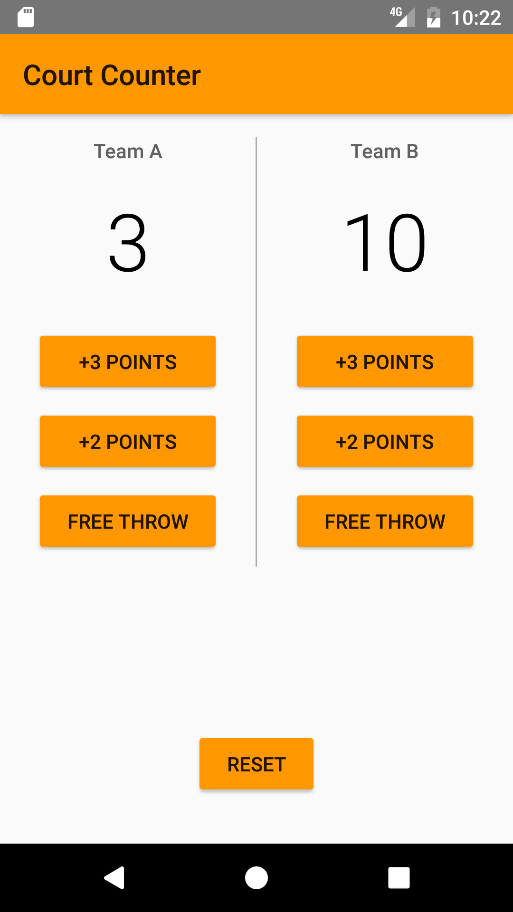

# Court Counter Android app

This is one of the projects from the "Android Basics: User Input" Udacity course.

## About the app

This is a simple app that lets you keep track of the scores of two basketball teams.

## Download

Download the apk file from the [releases page](https://github.com/kenneth-lau/court-counter-android-app/releases).

## GIF

## Screenshot

